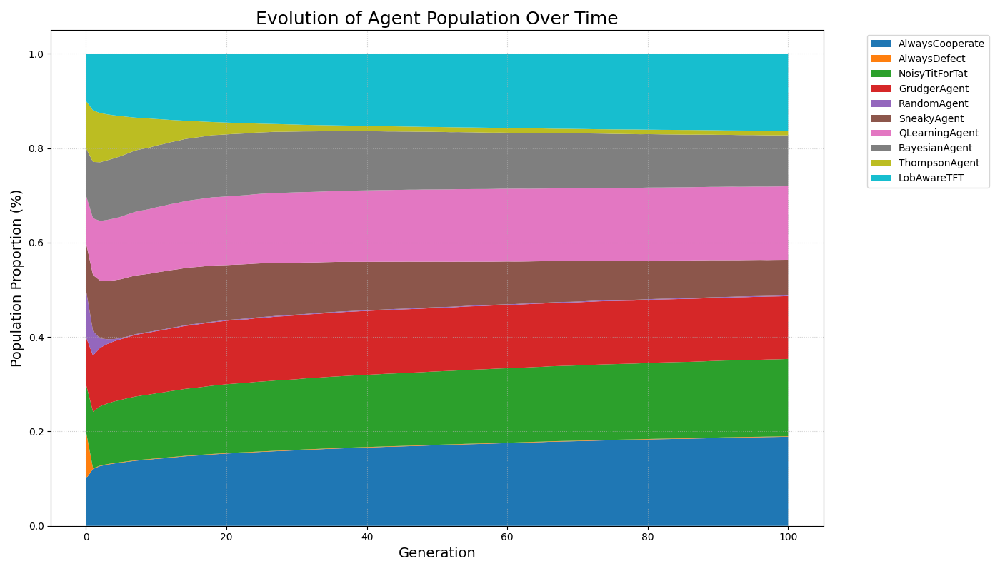

# EvoMarkets: An Agent-Based LOB Simulator

EvoMarkets is a high-performance, agent-based market simulator designed to model the evolutionary arms race of trading strategies in a realistic Limit Order Book (LOB) environment.

This project bridges the gap between classic game theory (the Iterated Prisoner's Dilemma) and modern financial-market microstructure. It re-frames "Cooperation" as passive liquidity provision (Limit Orders) and "Defection" as aggressive liquidity consumption (Market Orders).

The simulation runs in a latency-driven, 1-v-1 environment where agents compete based on not only their strategy but also their speed. The performance-critical LOB and matching engine are written in **C++** and exposed to Python using **Pybind11**.

---

## 🔬 Key Research Findings

This project runs two primary experiments to analyze strategy fitness: a **static tournament** (to find the best "all-around" performer) and a **dynamic evolution** (to find the most "dominant" strategy).

### Finding 1: Round-Robin Tournament (Static Analysis)

I ran a full round-robin tournament (36 matchups, 20 runs each, 1000 rounds per game) to find the strategy with the best average P&L vs. Risk.

**Conclusion:** The **`ThompsonAgent` ("The Manager")** was the clear winner, achieving the highest P&L (least loss) with minimal tail risk (CVaR). This shows that adaptive, learning-based strategies are the most robust. Pure aggression (`AlwaysDefect`) and pure randomness (`RandomAgent`) are catastrophic, loss-making strategies.


| Agent             | Avg. Final P&L | Avg. CVaR (95%) |
| :---------------- | :------------- | :-------------- |
| **ThompsonAgent** | **$-0.21**     | **$-0.01**      |
| `AlwaysCooperate` | $-1.00$        | $0.00$          |
| `BayesianAgent`   | $-1.06$        | $-0.01$         |
| `LobAwareTFT`     | $-3.18$        | $-0.02$         |
| `NoisyTitForTat`  | $-3.52$        | $-0.02$         |
| `QLearningAgent`  | $-6.22$        | $-0.15$         |
| `GrudgerAgent`    | $-7.10$        | $-0.02$         |
| `RandomAgent`     | $-21.09$       | $-0.96$         |
| `SneakyAgent`     | $-22.86$       | $-0.23$         |
| `AlwaysDefect`    | $-50.22$       | $-3.03$         |

---

### Finding 2: Evolutionary Simulation (Dynamic Analysis)

I ran a 100-generation evolutionary simulation with all 10 agents to find which strategies are "Evolutionarily Stable" (i.e., which ones take over the population).

**Conclusion:** No single strategy "wins." The market converges to a **stable, mixed ecosystem** dominated by a diverse group of "cooperative" (passive) and "retaliatory" (TFT-like) agents. The "aggressive" (`AlwaysDefect`) and "random" (`RandomAgent`) strategies are Evolutionarily Unstable and are driven to extinction.



| Strategy            | Final Population |
| :------------------ | :--------------- |
| **AlwaysCooperate** | **18.89%**       |
| **LobAwareTFT**     | 16.33%           |
| **NoisyTitForTat**  | 16.37%           |
| **QLearningAgent**  | 15.58%           |
| `GrudgerAgent`      | 13.33%           |
| `BayesianAgent`     | 10.79%           |
| `SneakyAgent`       | 7.54%            |
| `ThompsonAgent`     | 0.94%            |
| `RandomAgent`       | 0.14%            |
| `AlwaysDefect`      | 0.10%            |

---

## 🛠️ Key Features & Technical Architecture

- **High-Performance C++ Core:** The LOB and matching engine are written in C++ (using `std::map` and `std::list`) for a high-performance, O(1) order-matching and cancellation design.
- **Pybind11 Wrapper:** The C++ engine is compiled and "glued" to Python using `pybind11`, allowing a fast C++ core to be controlled by a flexible Python script.
- **Realistic Market Physics:** The simulation models:
  1.  **Latency:** Agents' actions are processed in a time-ordered event queue based on their `latency` attribute (the "HFT arms race").
  2.  **P&L (Reward):** Calculated as the profit/loss relative to the "mid-price." Defectors _pay_ the spread, and Cooperators _earn_ it.
  3.  **Cancel Fees:** A tiny fee is charged for unfilled limit orders, adding a realistic "cost of cooperation."
- **Advanced Agent Zoo:** A pool of 10 distinct strategies, including:
  - **Rule-Based:** `AlwaysCooperate`, `AlwaysDefect`, `NoisyTitForTat`, `GrudgerAgent`, `RandomAgent`, `SneakyAgent`.
  - **Market-Aware:** `LobAwareTFT` (a hybrid that reads the LOB state).
  - **Advanced Learning Agents:**
    - `QLearningAgent`: A model-free agent that learns from a "blank slate."
    - `BayesianAgent`: A model-based "detective" that uses `scipy.stats.norm` to model opponent "personalities."
    - `ThompsonAgent`: A "manager" that uses Gaussian Thompson Sampling to select the best strategy from its own internal portfolio.
- **Dual Simulation Modes:**
  1.  **Tournament (`run_experiment.py`):** Runs a static round-robin to find the best risk-adjusted performer.
  2.  **Evolution (`run_evolution.py`):** Runs a dynamic simulation using the **Replicator Equation** and a **`mutation_rate`** to find the Evolutionarily Stable Strategy (ESS).
- **Quant-Level Risk Analysis:** Includes functions to analyze P&L streams for **Value at Risk (VaR)** and **Conditional Value at Risk (CVaR)** to measure tail risk.

---

## 🏃 How to Run

This is a C++/Python hybrid project. You must have a C++ compiler (MSVC on Windows, GCC/Clang on Mac/Linux) and Python 3.10+ installed.

**1. Install Dependencies:**
The build requires `setuptools` and `pybind11`. The simulation requires `numpy`, `scipy`, `matplotlib`, and `pandas`.

```bash
pip install setuptools pybind11 numpy scipy matplotlib pandas
```
