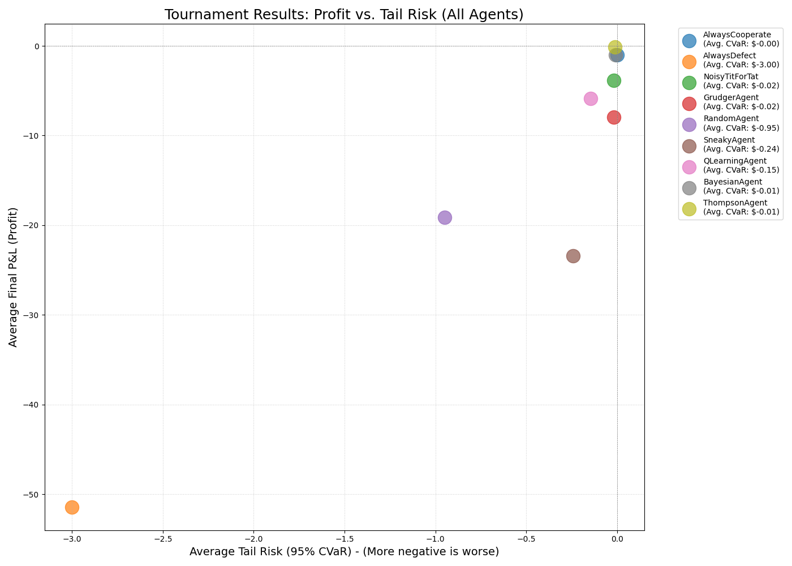

# EvoMarkets: A High-Fidelity Agent-Based Market Simulator

EvoMarkets is a high-performance simulation engine designed to model the evolutionary arms race of trading strategies in a realistic Limit Order Book (LOB) environment.

This project bridges the gap between classic game theory (the Iterated Prisoner's Dilemma) and modern financial-market microstructure. It re-frames "Cooperation" as passive liquidity provision (Limit Orders) and "Defection" as aggressive liquidity consumption (Market Orders).

The simulation runs in a latency-driven, 1-v-1 environment where agents compete based on not only their strategy but also their speed. The performance-critical LOB and matching engine are written in **C++** and exposed to Python using **Pybind11**.

## Core Features

- **Hybrid C++/Python Build:** A high-speed C++ matching engine (`std::map`-based, O(1) lookup) is wrapped with Pybind11 and controlled by a flexible Python simulation script.
- **Realistic Market Physics:** The simulation moves beyond simple payoffs to model real-world market dynamics:
  - **Latency:** Agents' actions are processed in a time-ordered event queue based on their `latency` attribute.
  - **Bid-Ask Spread:** P&L is calculated from the spread. Defectors (Market Orders) _pay_ the spread, while Cooperators (Limit Orders) _earn_ it.
  - **Order Resting Fees:** A "cancel fee" (`clear_agent_orders`) is applied to unfilled limit orders, adding a cost to being purely passive.
- **Rich Action Space:** Agents choose from a spectrum of actions, defined by `(type, price_level, size)`.
- **Advanced Agent Zoo:** The simulation includes a wide range of rule-based and learning agents:
  - **Rule-Based:** `AlwaysCooperate`, `AlwaysDefect`, `NoisyTitForTat`, `GrudgerAgent`, `SneakyAgent`, `RandomAgent`.
  - **Bayesian "Detective":** A `BayesianAgent` that uses probabilistic inference (bell curves via `scipy.stats.norm`) to identify its opponent and play the optimal counter-strategy.
  - **Q-Learning Agent:** A model-free `QLearningAgent` that learns an optimal policy for a discrete state/action space from a "blank slate."
  - **Thompson "Manager":** A `ThompsonAgent` that uses Gaussian Thompson Sampling to manage a portfolio of sub-strategies, learning to deploy the most profitable one.
- **Quant-Level Risk Analysis:** Performance is measured not just by average profit, but by **Value at Risk (VaR)** and **Conditional Value at Risk (CVaR)** to find the most robust, risk-adjusted strategies.

## Initial Findings (Example Matchup)

The simulation measures which strategy is the most "fit" in a tournament. Fitness is defined by the best trade-off between final P&L (profit) and tail risk (CVaR).

In a 36-matchup, 720-run tournament (720,000 total rounds), the results show a clear hierarchy of strategies:

| Agent             | Avg. Final P&L | Avg. CVaR (95%) | Analysis                                                                                        |
| :---------------- | :------------- | :-------------- | :---------------------------------------------------------------------------------------------- |
| **ThompsonAgent** | **$-0.12**     | **$-0.01**      | **WINNER:** The "manager" agent successfully learned to minimize losses.                        |
| **BayesianAgent** | $-1.02$        | $-0.01$         | Strong performance; its internal model correctly identified and played safe strategies.         |
| `AlwaysCooperate` | $-1.00$        | $0.00$          | The "cancel fee" for unfilled orders makes this pure-passive strategy a small loser.            |
| `NoisyTitForTat`  | $-3.84$        | $-0.02$         | A balanced, "safe" strategy that avoids high costs but still loses to fees/aggression.          |
| `GrudgerAgent`    | $-7.93$        | $-0.02$         | More vulnerable than TFT; its "unforgiving" nature leads to costly defect-loops.                |
| `QLearningAgent`  | $-5.89$        | $-0.15$         | It learned to avoid bad moves, but the "cost of education" (random exploration) was high.       |
| `SneakyAgent`     | $-23.44$       | $-0.24$         | The "sneaky" defections were not profitable enough to cover their high cost (slippage).         |
| `RandomAgent`     | $-19.10$       | $-0.95$         | Purely random behavior is a clear losing strategy.                                              |
| `AlwaysDefect`    | $-51.44$       | $-3.00$         | **EXTINCTION:** The high cost of constantly paying the spread makes this strategy catastrophic. |



## How to Run

This is a C++/Python hybrid project. You must have a C++ compiler (MSVC on Windows, GCC/Clang on Mac/Linux) and Python 3.10+ installed.

**1. Install Dependencies:**
The build requires `setuptools` and `pybind11`. The simulation requires `numpy`, `scipy`, and `matplotlib`.

```bash
pip install setuptools pybind11 numpy scipy matplotlib
Build the C++ Engine: pip install .
Run the Full Tournament: Once the build is successful, run the main experiment script using python run_experiment.py
```
